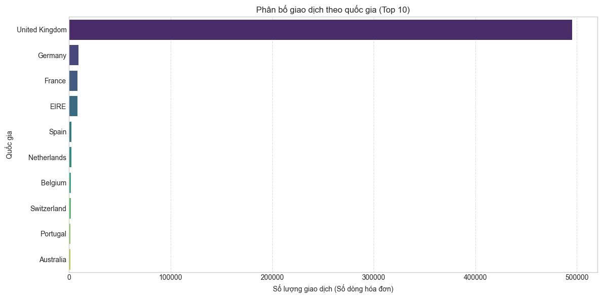
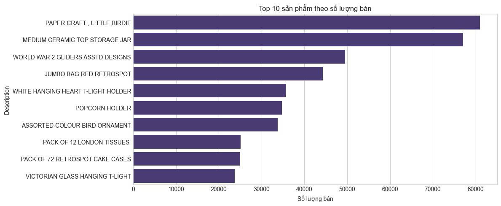
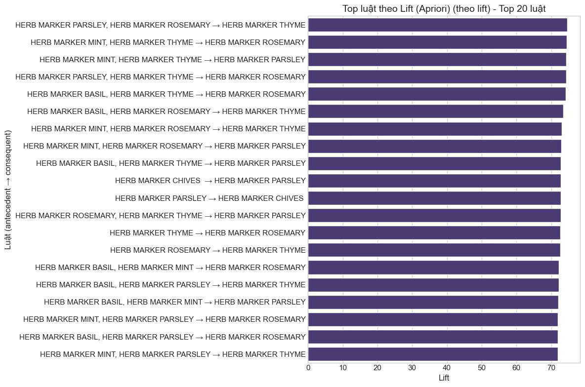
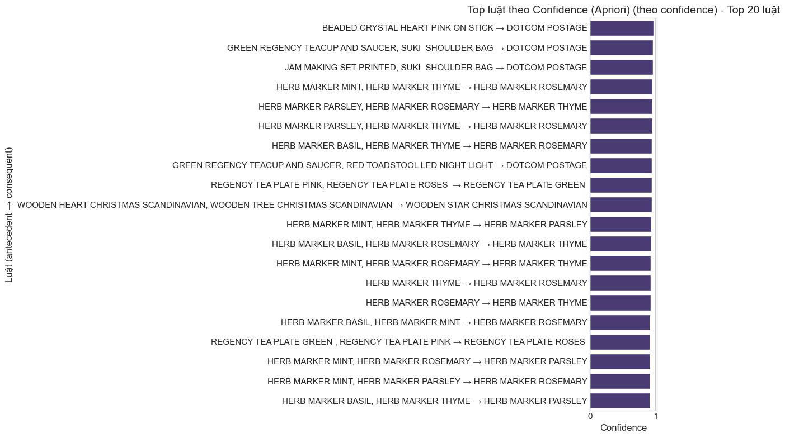
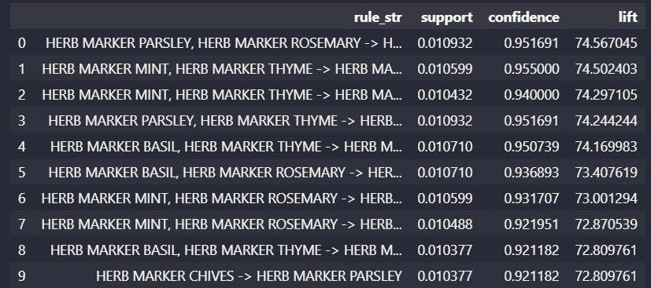

BÁO CÁO MINI PROJECT: PHÂN CỤM KHÁCH HÀNG DỰ TRÊN LUẬT KẾT HỢP

1. Giới thiệu bài toán
   Dự án thực hiện phân khúc khách hàng dựa trên dữ liệu giao dịch bán lẻ trực tuyến tại Anh (UK). Thay vì sử dụng các đặc trưng RFM truyền thống, dự án này áp dụng phương pháp tiếp cận mới: Trích xuất đặc trưng từ các Luật kết hợp (Association Rules) để hiểu sâu hơn về hành vi mua sắm đồng thời giữa các sản phẩm, từ đó phân nhóm khách hàng có sở thích tương đồng.

2. Quy trình thực hiện (Pipeline)
   Tiền xử lý dữ liệu: Làm sạch, xử lý giá trị thiếu, loại bỏ đơn hàng ảo/hủy và lọc dữ liệu thị trường UK.

Khai phá tập mục phổ biến: Sử dụng thuật toán Apriori để tìm các nhóm sản phẩm thường xuyên xuất hiện cùng nhau.

Sinh luật kết hợp: Trích xuất các luật mạnh dựa trên các chỉ số Support, Confidence và Lift.

Feature Engineering: Chuyển đổi các luật kết hợp thành ma trận đặc trưng cho từng khách hàng.

Phân cụm khách hàng: Áp dụng thuật toán K-Means để phân nhóm dựa trên hành vi mua sắm theo luật.

3. Kết quả phân tích dữ liệu (EDA)
   Xác định các đặc điểm chính để thiết lập tham số cho mô hình:

Phân phối giao dịch: Tập trung vào thị trường UK vì đây là thị trường lớn nhất và ổn định nhất.

Sản phẩm phổ biến: Các mặt hàng như "WHITE HANGING HEART T-LIGHT HOLDER" thường xuyên đứng đầu, gợi ý ngưỡng min_support phù hợp.

4. Khai phá luật kết hợp (Association Rules)
   Chúng tôi sử dụng thuật toán Apriori với các ngưỡng: min_support=0.01 và min_lift > 1.2.

4.1. Top luật theo chỉ số Lift
Chỉ số Lift cao thể hiện mối quan hệ rất mạnh giữa các sản phẩm (ví dụ: các bộ nhãn đánh dấu thảo mộc - Herb Markers thường được mua cùng nhau với Lift > 70).

4.2. Top luật theo chỉ số Confidence
Thể hiện xác suất khách hàng mua thêm sản phẩm tiếp theo khi đã chọn sản phẩm trước đó.

4.3. Bảng 10 luật tiêu biểu có Lift cao nhất

5. Phân cụm khách hàng (K-Means Clustering)
   Sử dụng phương pháp Elbow Method để xác định số cụm tối ưu ($K$).
   
   Nội dung: Phân chia khách hàng thành các nhóm dựa trên đặc điểm tương đồng.

Phân loại: Có 2 cụm rõ rệt (màu tím và màu vàng) được trực quan hóa trên không gian 2 chiều (PCA) để dễ dàng nhận diện nhóm khách hàng khác biệt (ví dụ: nhóm chi tiêu ít vs. nhóm chi tiêu nhiều).

6. Kết luận và Ứng dụng
   Cross-selling: Sử dụng luật kết hợp để gợi ý sản phẩm ngay trong giỏ hàng.

Marketing cá nhân hóa: Gửi thông điệp quảng bá theo bộ sản phẩm cho cụm khách hàng "Set buyers".

Quản lý kho: Sắp xếp các sản phẩm có Lift cao gần nhau trong kho hoặc trên gian hàng trực tuyến.
